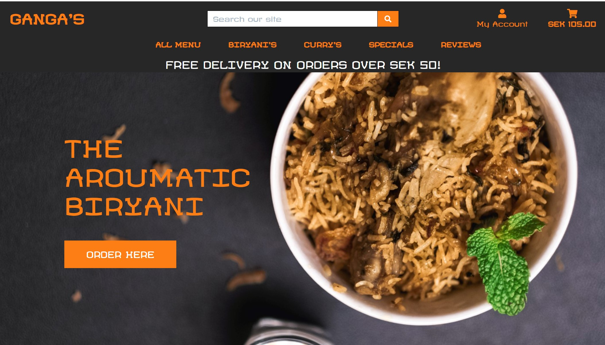

<div align="center">
    <a href="https://gangas-ms4.herokuapp.com/" target="_blank"></a>
    <h2>
        Gangas is a food items purchase portal designed for enthusiastic Indian food lovers. 
    </h2>
    <h3><a href="https://gangas-ms4.herokuapp.com/" target="_blank">Click here</a> to view the live website.</h3>
</div>

## Table of Contents

1. [**Overview**](#overview)
2. [**User Experience**](#user-experience)
    - [**User Stories**](#user-stories)
    - [**Site owner Stories**](#site-owner-stories)
    - [**Database diagram**](#database-diagram)
    - [**Wireframes**](#wireframes)
    - [**Design**](#design)
3. [**Features**](#features)
    - [**Homepage Features**](#homepage-features)
    - [**Dish and Dish detail page Features**](#dishanddishdetail-features)
    - [**Review page Features**](#review-features)
    - [**Profile page Features**](#profile-features)
    - [**Cart page Features**](#cart-features)
    - [**Checkout page Features**](#checkout-features)
    - [**Future Features**](#future-features)
4. [**Technologies Used**](#technologies-used)
5. [**Testing**](#testing)
6. [**Deployment**](#deployment)    
7. [**Credits**](#credits)
8. [**Acknowledgements**](#acknowledgements)

## Overview

The main aim of this website is to reach the customers , who are more interested in Indian food, for making it easier to buy the food online and a delivery will follow
soon

Business Goals

  - Create a Food shopping website 

    - To reach the Indian food lovers in the Gothenburg, Sweden to make it easy for them to taste the food from India.

  - Provide a simple interface to shop and buy the food dishes

    - User can simply navigate , shop, add their dishes to the cart and buy them using a credit card even without registering their email and also with their account
	  registered


User goals

  - A website to choose various food dishes from India, which are authentic and tasteful

    - All dishes which can be bought on the website are easily checked in detail, and prices as well

  - An easy to search information website

    - Search bar, provided directly on the Home page will provide results based on the user input keywords.

  - Easy to buy the dishes online using a payment system

    - Any user can easily add the dishes to the cart and buy them using a credit card or debit card.

  - Easy to give feedback on the dishes they choose 

    - Review page can be easily navigated to , and a star rating and comments can be provided to the selected dish


## User Experience

- ### User Stories

    As a guest/registered user of Ganga's website for the first time, I want:
    
  1. To view a list of dishes , that Ganga's provide so that I can purchase them
	2. To view individual dish in detail so that I can check the price, rating, description
	3. To identify special dishes, discounts etc and take advantage of the discounts, combos I would like to purchase
	4. To subscribe to the site, so that I receive discounts on my email
	5. To sort the list of all dishes available based on rating, price and category
	6. To view and sort the dishes based on the specific category
	7. To search the dish using a keyword and get the results which are countable
	8. To add the dishes to the cart, and continue shopping to view more dishes
	9. To securely pay the amount using a card and get confirmation of my order on email
	10. To receive notifications as soon as I add some dish to the cart or any other similar action
	11. To easily register for an account using my email and name
	12. To easily access my profile using login and logout
	13. To recieve an email confirmation after registering
	14. To have a personalized user profile where I can see my previous orders
	15. To see info of the site, contact information and social media links.
 

- ### Site owner stories

    As an admin/ site owner of Gangas website, I want:

    1. To be able to add, modify and delete the dishes and maintain the website
    

- ### Database diagram to be done

  - [Database Diagram](https://github.com/murthy1811/Milestone-Project-3-AirBubble/blob/master/static/assets/wireframes/database_diagram.jpg).
  

- ### Wireframes to be done

  The wireframes for this project were created using figma.
    
  - [Desktop Home](https://github.com/murthy1811/Milestone-Project-3-AirBubble/blob/master/static/assets/wireframes/desktop_home.jpg).

  - [Tablet Home](https://github.com/murthy1811/Milestone-Project-3-AirBubble/blob/master/static/assets/wireframes/tablet_home.jpg)

  - [Mobile Home](https://github.com/murthy1811/Milestone-Project-3-AirBubble/blob/master/static/assets/wireframes/mobile_home.jpg)

  - [Desktop Login or Signup](https://github.com/murthy1811/Milestone-Project-3-AirBubble/blob/master/static/assets/wireframes/desktop_login_signup.jpg).

  - [Mobile Login or Signup](https://github.com/murthy1811/Milestone-Project-3-AirBubble/blob/master/static/assets/wireframes/tablet_login_signup.jpg)

  - [Mobile Login or Signup](https://github.com/murthy1811/Milestone-Project-3-AirBubble/blob/master/static/assets/wireframes/mobile_login-signup.jpg)

  - [Desktop New or Edit Story](https://github.com/murthy1811/Milestone-Project-3-AirBubble/blob/master/static/assets/wireframes/desktop_newstory_editstory.jpg).

  - [Tablet New or Edit Story](https://github.com/murthy1811/Milestone-Project-3-AirBubble/blob/master/static/assets/wireframes/tablet_newstory_editstory.jpg)

  - [Mobile New or Edit Story](https://github.com/murthy1811/Milestone-Project-3-AirBubble/blob/master/static/assets/wireframes/mobile_newstory_editstory.jpg)

  - [Desktop Profile](https://github.com/murthy1811/Milestone-Project-3-AirBubble/blob/master/static/assets/wireframes/desktop_profile.jpg).

  - [Tablet Profile](https://github.com/murthy1811/Milestone-Project-3-AirBubble/blob/master/static/assets/wireframes/tablet_profile.jpg)

  - [Mobile Profile](https://github.com/murthy1811/Milestone-Project-3-AirBubble/blob/master/static/assets/wireframes/mobile_profile.jpg)

  - [Desktop Readmore](https://github.com/murthy1811/Milestone-Project-3-AirBubble/blob/master/static/assets/wireframes/desktop_readmore.jpg).

  - [Tablet Readnore](https://github.com/murthy1811/Milestone-Project-3-AirBubble/blob/master/static/assets/wireframes/tablet_readmore.jpg)

  - [Mobile Readmore](https://github.com/murthy1811/Milestone-Project-3-AirBubble/blob/master/static/assets/wireframes/mobile_readmore.jpg)


- ### Design

  - #### Colour Scheme

    I used Orange/White/black colors as basic and overall site is designed using these colors in order to resemble the colorful culture of India

  - #### Typography

    Fonts 'Revalia' is used to bring out the funky style to keep the site as special as a restaurant

    

## Features

- ### Homepage Features

   1.Header contains the logo with link to the homepage
   2. Search bar is included next to the logo
   3. Shopping cart which can be seen across the site with displaying the total purchased amount at any given time, and also takes you to cart page upon clicing
   4. Also, My account icon is provided to register a user or login for the registered user
   5. A registered user after login can see logout option and and personalized My profile which takes to user profile
   6. Navigation bar is incorporated to see all the dishes available and different icons to sort them out by price, rating and also categorized
   7. Home image contains an order button which takes you directly to the all menu
   8. Footer displays the site information, social media links, and contact information

- ### Dishes and Dish Detail features
  
  1. Dishes page can be accesssed by clicking all menu or order button.
  2. Contains all dishes displayed in card format with price, category and rating detials given.
  3. Each dish card takes you to the detail page where the additional information is provided 
  4. Dish detail page contains quantity selector button, , add to cart, and also eat more to take back to the all menu

- ### Review Features

  1. Review page can be accessed by clicking on navbar option reviews.
  2. Rating of the each dish can be done using select drop down button, and a star rating and also a comment box
  3. A subscritipon email box is provided for users to subscribe to receive offers and discounts.

- ### Profile features

  1. User profile page contains default delivery information which can be filled and saved
  2. Order history can be seen with order number, date, items and total

- ### Cart features
  
  1. Cart can be accessed by clicking the shopping cart icon on any page
  2. Items quantity can be added or removed here using +/- icons.
  3. Eat more button takes you to all menu to add more dishes
  4. Secure checkout takes you to checkout page for proceeding with payment

- ### Checkout features

  1. Checkout page contains a form where user need to fill in for delivery information
  2. You can use a card for payment and complete the order
  3. Upon completion, Order success form is generated
  4. A recommmendation is to made to login , to save the delivery information for all future 
  5. For logged in user, option to save the information is provided

- Toast messages for success, error and others have been incorporated for easy understanding of the user

### Future Features
 
The following are elements that could be added to the website in future development:

- A forgot password option where,on clicking asks user to input their email and a password change link can be sent to their email

- A online chat window where all registered users can interact live.

- Delivery tracking system

- Sizes for the dishes can be added and price change can be built. Due to time constraint, Sizes code has been written but not added to the site.

## Technologies Used

- #### **Front-end**

    ### Languages Used

    - [HTML5](https://en.wikipedia.org/wiki/HTML5)

    - [CSS3](https://en.wikipedia.org/wiki/Cascading_Style_Sheets)

    - [JavaScript](https://www.javascript.com/)

    - Python

    ### Frameworks, Libraries & Programs Used

	- Django

	- Stripe

	- Amazon S3

    - [Startbootstrap](https://startbootstrap.com/)

       Startbootstrap is used to select the theme 'Landing page' for the website and form html code is generated using the same.

    - [jQuery](https://jquery.com/)

       jQuery is used to simplify the JavaScript code and DOM manipulation. 

    - [Bootstrap 4.5](https://getbootstrap.com/)

       Bootstrap is used to assist with the responsiveness and styling of the website.

    - [GitPod](https://gitpod.io)

       GitPod was used as the IDE for this project.

    - [Git](https://git-scm.com/)

      Git is used for version control by utilizing the Gitpod terminal to commit to Git and Push to GitHub.

    - [GitHub](https://github.com/)

      GitHub is used to store the project's code after being pushed from Git.

    - [Figma](https://www.figma.com/wireframe-tool/)

      Figma is used to create the wireframes during the design process.

    - [Font Awesome](https://fontawesome.com/)

      Font Awesome is used to obtain the icons used in this website.

    - [Autoprefixer](https://autoprefixer.github.io/)

      Autoprefixer was used to add vendor prefixes.

    - [JS hint](https://jshint.com/)

      Jasmine was used to test this project's JavaScript functions.

	### Databases

	- SQlite3
	- PostgreSQL


- #### **Deployment**
    * **Git** - used to keep track of the changes made to the repository and for version control.
    * **Gitpod** - I used CI full template as an IDE to develop, commit and push files to GitHub. 
    * **GitHub** - used as a hosting service and for future collaborations.
    * **Heroku** - my GitHub repo for this project had been connected to Heroku app to enable management and deployment of this app.

## Testing

The testing data for this project can be found in a separate file called [here](https://github.com/murthy1811/gangas_biryani/blob/master/TESTING.md).

### Issues and Solutions
* While adding the Reviews model, several issues popped due to the python code errors. Each error is fixed by carefully studying-
* Bootstrap classes implementation went hard in order to maintain the right flow
* Review page showed internal server error after deployment to heroku. Identified djago package error which I wrote into code and fixed
* Review page css fixed for all smaller screens to adjsut the page overall.


## Deployment

- #### **Requirements:**
    * **Python3** to write the code and run the application
    * **PIP** to install packages
    * **Git** for version control
    * **GitPod** powered by VS Code was used for this project (any IDE of your choice will work)
    * **Django** - to create the models
    * **Heroku** - to deploy and manage the app


### Project Creation

* This project was created using the CI recommended [Gitpod Full Template](https://github.com/Code-Institute-Org/gitpod-full-template).
* Click on **_Use this template_** button and enter a short and memorable name of your choice for your repo and select **_Create repository from template_**. 
* Once created, click on green **_Gitpod_** button to open your new workspace. 

 	1.  Log in to your  Gitpod account 
	2.  Clone this project repository from GitHub
    -   Go to my [Gangas_Biryani repository](https://github.com/murthy1811/gangas_biryani) 
 	3. Add Gitpod browser extension for Chrome:
    -   Go to  [GitPod Chrome Browser Extension](https://chrome.google.com/webstore/detail/gitpod-online-ide/dodmmooeoklaejobgleioelladacbeki)
  	4.  If you  installed the extension you should view a green Gitpod button on the top right corner of page. Next to Clone or Download button. 
  	5. When clicked this button will allow you to open this repository directly in Gitpod.
	6.  The following environment variables needs to be set:

		KEY | VALUE
		------------- | ------------- | 
		DATABASE_URL | <DATABASE_URL>
		AWS_ACCESS_KEY_ID | <AWS_ACCESS_KEY_ID>
		AWS_SECRET_ACCESS_KEY | <AWS_SECRET_ACCESS_KEY>
		EMAIL_HOST_PASSWORD | <EMAIL_HOST_PASSWORD>
		EMAIL_HOST_USER | <EMAIL_HOST_USER>
		SECRET_KEY | <SECRET_KEY>
		STRIPE_PUBLIC_KEY | <STRIPE_PUBLIC_KEY>
		STRIPE_SECRET_KEY | <STRIPE_SECRET_KEY>
		STRIPE_WH_SECRET | <STRIPE_WH_SECRET>
		USE_AWS | True

7.  Download all the dependencies to run this project and listed in the  **requirements.txt**  by running command **pip3 install -r requirement.txt**.
8.  Create a local development server. In the workspace run the following command  **python3 manage.py runserver** . Now you should have a Gitpod link to the deployed app.
</details>

### Deployment to Heroku
Heroku cloud platform was used to deploy and host this app by following the steps below:

* **Set up workspace for Heroku:** 
    * In the terminal window of your IDE, create a requirements.txt file to contain all applications and dependencies required to run the app.

        ``` pip3 freeze --local . requirements.txt```
    * Create a Procfile (always with a capital P and no file extension!) - required by Heroku, to know which file runs the app.

        ``` echo web: python app.py > Procfile```

* **Create application in Heroku:**
    * Navigate to [Heroku](https://www.heroku.com/home) website and create an account.
    * Once logged in, click on the **_New_** button and select **_Create New App_**
    * Create a name for your app and select the region closest to your location.

* Now go back to Heroku and click on **_Enable Automatic Deployment_** and **_Deploy Branch_**.
* The app is now connected and Heroku will receive the code from GitHub and automatically update whenever we push changes to the GitHub repository. You should be able to see "Your app was successfully deployed!". Click on **_View_** to launch your app.


### Clone the project
Steps required to **_Clone_** a repository from GitHub to your local machine:
* Navigate to the repository in GitHub.
* Click on the **_Code_** dropdown menu button.
* Click on **_Open with GitHub Desktop_** and follow the prompts to complete the cloning process.

### Fork the project
* To create a personal copy of this repository, click on **_Fork_** button on the top right corner of the repository page in GitHub.


### Run Locally
To run this project on your device using the IDE of your choice follow these steps:
* Install the requirements by typing in your IDE: 

1. Install **gunicorn** to run the application on Heroku by running command **sudo pip3 install gunicorn**
2. Install **pycopg2** to connect to PostgreSQL by running command  **sudo pip3 install psycopg2**
3. Create a **requirements.txt** file by running command **sudo pip3 freeze --local > requirements.txt**
4. Create a new Heroku application by clicking **New** after **Create New App**. Give a name to your app and click **Create app**
5. Install PostgreSQL add-on by running command **heroku addons:create heroku-postgresql:hobby-dev**
6. Create a Procfile by running command **echo web: gunicorn gangas_biryani.wsgi:application > Procfile**
7. Following config variables needs to be set:

KEY | VALUE
------------- | ------------- | 
DATABASE_URL | <DATABASE_URL>
AWS_ACCESS_KEY_ID | <AWS_ACCESS_KEY_ID>
AWS_SECRET_ACCESS_KEY | <AWS_SECRET_ACCESS_KEY>
EMAIL_HOST_PASSWORD | <EMAIL_HOST_PASSWORD>
EMAIL_HOST_USER | <EMAIL_HOST_USER>
SECRET_KEY | <SECRET_KEY>
STRIPE_PUBLIC_KEY | <STRIPE_PUBLIC_KEY>
STRIPE_SECRET_KEY | <STRIPE_SECRET_KEY>
STRIPE_WH_SECRET | <STRIPE_WH_SECRET>
USE_AWS | True


**[back to top](#wd-buzzwords)**

## Credits

- All images used were downloaded from Unsplash, Pexels, Pixabay and freepik.com with various user's contribution

### Code

- Used bootstrap for formatting and responsiveness
- Major HTML code and css  is also adapted from the template from startbootstrap.com
- A lot of mistakes were identified and corrected in Review page code, thanks to github user Erneste Majute , as I got influenced and used some code.


## Acknowledgements

Thank you to my mentor Felipe Souza Alarcon for his support and guidance during this project.

Thank you to the Code Institute Slack community for their advice and tips.


<div align="right">
    <a href="#table-of-contents"> ⇧ Back To Top </a>
</div>