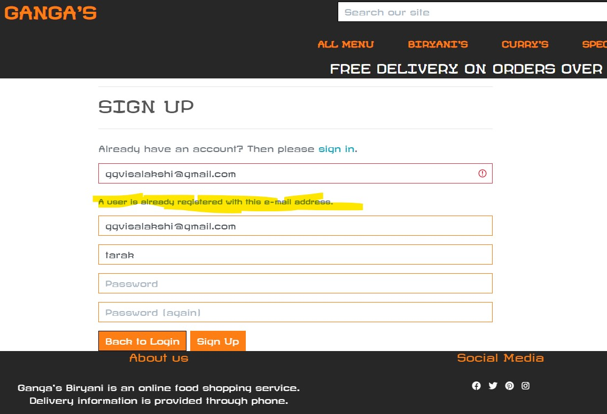
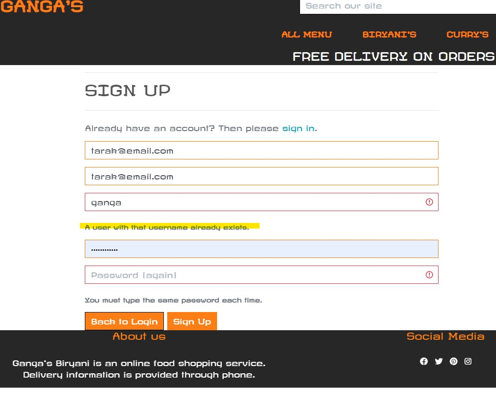
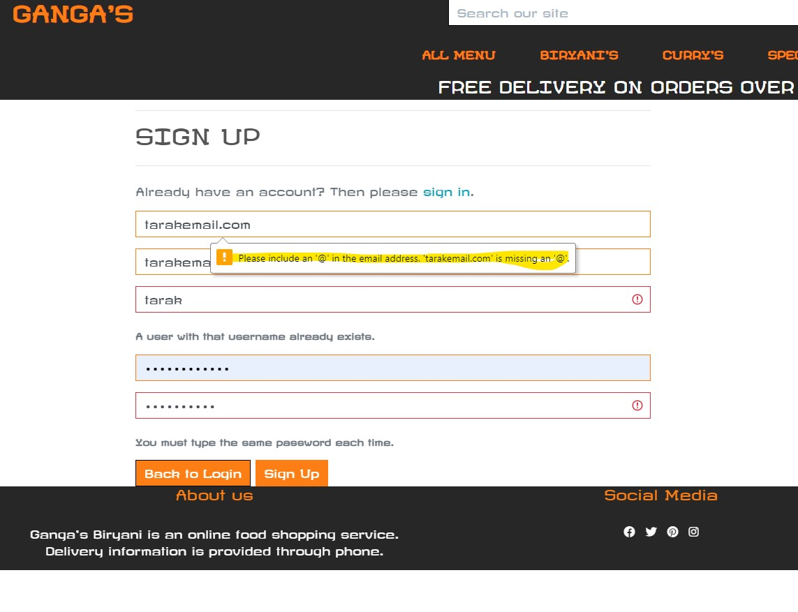
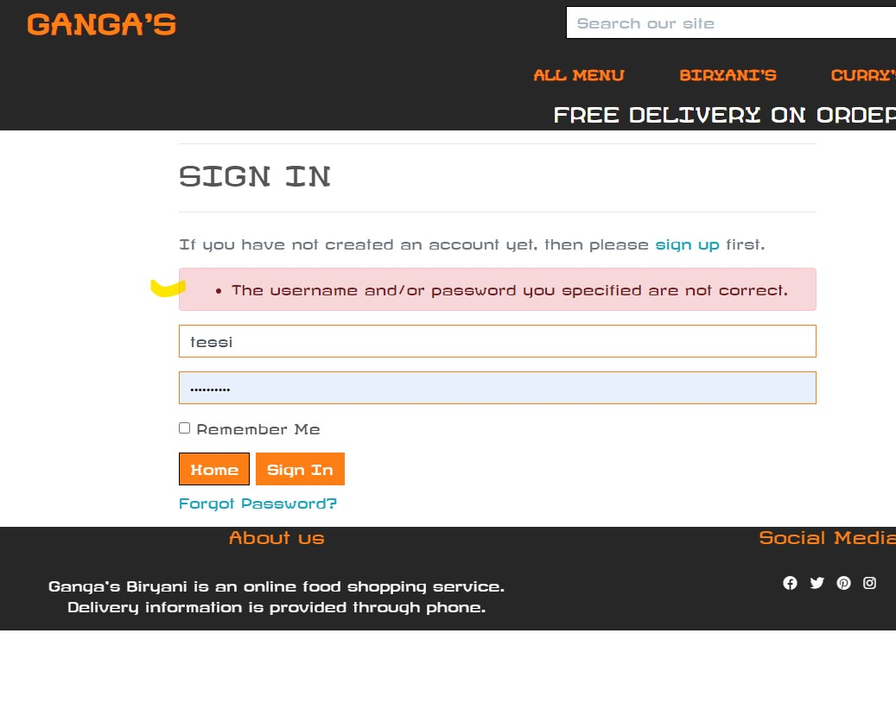
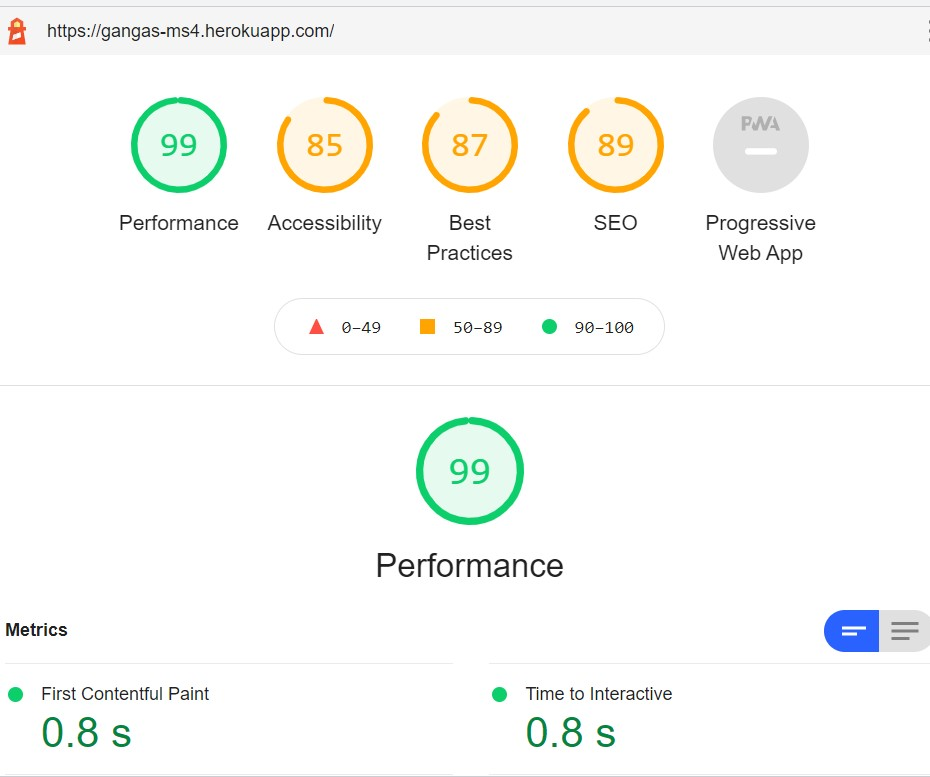

## **Testing**
___
___
### Table of Contents

  * [Code Validity](#code-validity)
  * [Testing User Stories](#testing-user-stories)
  * [Functionality Testing](#functionality-testing)
  * [Defensive Design Testing](#defensive-design-testing)
  * [Responsiveness](#responsiveness)
  * [Usability Testing](#usability-testing)
  * [Performance Testing](#performance-testing)
  * [Browser Compatibility Testing](#browser-compatibility-testing)

### Code Validity
___

- HTML Markup Validation - [pass](https://validator.w3.org/nu/)
  * All pages passed the validator except for errors and warnings due HTML validator not being able to recognize Jinja.
    Validation is done trhough URL a well and resulted in no errors.
- CSS Validation - [pass](https://jigsaw.w3.org/css-validator/)
- JavaScript Code Quality Tool JSHint - [pass](https://jshint.com/)
- PEP8 - [pass](http://pep8online.com/)
- Flake 8 errors fixed but some of the adjustments is causing trouble to the functionality of the site. So due to time 
  constraint , some errors have been left without effecting functionality

### Testing User Stories
___

  **Guest/Registered user or Shopper**

* As a Shopper To view a list of dishes , that Ganga's provide so that I can purchase them
  * The Home page feature 'order now' button is tested to see if it takes to the all dishes page and checked to add the dishes to the cart.

* As a Shopper to view individual dish in detail so that I can check the price, rating, description
  - In the dishes page, some of the dishes are clicked, and checked if it takes to the dish detail page, and all the details are clearly written

* As a Shopper to identify special dishes, discounts etc and take advantage of the discounts, combos I would like to purchase
  - On the main navigation, Specials are categroized separately and is tested to see if the combos, discounted dishes are showing up.

* As a Shopper to subscribe to the site, so that I receive discounts on my email
  - On the reviews page, sample email is entered into the subscription box and tested. Success message generated and email showed up in subscription list

* As a Shopper, to sort the list of all dishes available based on rating, price and name
 - On the all dishes page, a side box is provided to sort the dishes based on price, alphabetically etc

* As a Shopper, To view and sort the dishes based on the specific category
 - All the dishes can be viewed based on different categories directly from the navigation liek curry's , Biryani's and can be sorted rating, price wise too. 
   all the links have been clicked and tested to see if the respective dishes are being shown.

* As a Shopper, To search the dish using a keyword and get the results which are countable
 - Search bar provided in header is tested by searching with input and also with no input. Corresponding results are shown.

* As a Shopper, To add the dishes to the cart, and continue shopping to view more dishes
 - Random dishes are clicked and went into detail page, add to cart and eat more buttons are tested to see if the dish is being added to the cart
    and Eat more button takes you back to all menu.

* As a Shopper, To securely pay the amount using a card and get confirmation of my order on email
 - Added dishes in cart ,and checkout buttons are tested, and went to payment page, testing visa card number is given , and payment is made successfully.
   Order confirmation email is also provided.

* As a Shopper, To receive notifications as soon as I add some dish to the cart or any other similar action
 - Actions such as adding dishes to the cart, updating the dishes to the cart, deleting them, and logout, login buttons were tested and all actions 
   recieved toast messages on the far top right corner. 

* As a Shopper, To easily register for an account using my email and name
 - Register button is accessed through My account nav icon and email and all details entered to see if registraton is successful. Confirmation email to activate
   has been received and after confirmation, account has been created in database, and account is successfully logged in

* As a Shopper, To easily access my profile using login and logout
  - Registered user testing has been done and my profile has been accessed. Both Login and Logout buttons are working successfully

* As a Shopper, To recieve an email confirmation after registering
 - After registration is made, confirmation email to activate the account has been received by the user

* As a Shopper, To have a personalized user profile where I can see my previous orders
 - An order has been made as a registered user, and order history is visible in my profile page

* As a Shopper, To see info of the site, contact information and social media links.
 - Footer page is provided with contact info, social links ,and site about us. All links are accessible and email, phone links prompt the user to take initiation.

 **Site owner / admin**

* As a site owner of Gangas, I want to be able to add, delete, update the dishes and access other information.
 - Superuser account has been logged in, and all dishes have the edit and delete buttons and are working successfully.
   Dish management page is accessible via my account and new dishes can be added with all the information. All the jobs can also be done on admin page after logging in
   Security has been provided to stop other users to make changes to the site. Subscription users and email management is accessible through Admin page

**[back to top](#testing)**

### Functionality Testing
___

 **Home Page**

  **Navigation Bar**

  - The bootstrap navbar is fixed and is visible across all pages and on all screen size devices. Navbar menu collapses into a hamburger menu on smaller devices.
  - The sidenav, which was used in conjunction with the fullscreen navigation is working as desired and is visible on screen sizes
  - All the links on both, navbar and a sidenav were checked by clicking and are working as intended, allowing users to jump to the linked page.
  - The brand logo link was also tested by clicking and is working correctly, as it takes users back to the Home page from anywhere on the site.
  - Order now button is tested to see if all dishes can be seen and is working fine.

  **Search box**
  
  The input field was tested by:
  * Entering keywords which contain dish names that exist in the site and clicking the _Search button_ - dish or dishes, in case if more than one is available, are displayed 
  * Typing words that are not in the website stories and clicking the Search button - nothing is displayed on the page.

  **Dishes**
  
  Selected travel story cards were tested by:
  * clicking on read more button and to see if all the information can be read on a new page.
  * This step is repeated on all different devices and checked if rendered information is easy to read and neatly aligned.

**Login Page**

* The page only appears when the user is not logged in.
* Verified, the toast message always pops up when users successfully log in to the website. 
* Link below the login section was clicked to test and is functioning as it should, redirecting users to the _Sign Up_ page.
* Both username and password fields are tested with out an entry and user is prompted to enter the details
* In case of either wrong username or wrong password, a flash message is displayed to let the user know the details are wrong.
* Forgot password is tested and emai lhas been recieved to update.

 **Sign Up Page**

* Sign Up page only appears when the user is not logged in.
* Toast message pops up to confirm the successul registration.
* The link for sign in is fully functional, redirects users to the _Log In_ page.
* All the entries are tested without entering any details, and user is prompted to enter the details
* Email address is entered in wrong format and user is prompted to enter the right format
* Requirements of username and password are tested with wrong format entry( apart from numbers and letters) and user is 
  prompted to enter the right format
* successfull sign up takes the user to their profile page, and navbar is displayed with share my story and logout options.

 **Profile Page**

* Profile page is checked if the right username and right email address is displayed as entered by user
* Current password is wrongly entered to test if the user be given a message to enter the right password.
* Page is checked to see if the information can be saved for future payment
* Order history is checked and clicked on the previuous order to see if the details are displayed

**Cart**

* Cart page is checked to see if the dishes added can be updated or removed. 
* Checked if the secure check out and eat more buttons are working as intended
* Checked to see if cart becomes empty after removing all dishes
* Checked to see if the total and subtotal are updated upon increasing or decreasing the dishes quantity

**Log Out Page**

* The page is visible for logged in users only.
* The _Log Out_ link on the navbar (sidenav on smaller screens) is working as expected and logs users out of their account when clicked only after confirmation
* Further tests verified that users are then redirected to the home page.

**Checkout Page**

* Tested to see if the information column is being filled as intended , with the wrong inputs and right ones.
  user is prompoted to correct the inputs in case they enter wrong information

. For Checkout testing process use test credit card numbers provided by [Stripe documentation](https://stripe.com/docs/payments/accept-a-payment).

Number | Description 
------------- | -------------
4242424242424242 | Succeeds and immediately processes the payment.
4000000000003220 | 3D Secure 2 authentication must be completed for a successful payment.
4000000000009995 | Always fails with a decline code of insufficient_funds.

**Admin user profile**

* Admin user is logged in and tested if the admin can be able to delete all the dishes, emails and users.

**[back to top](#testing)**

### Defensive Design Testing
___
* **Registration attempt with an existing email address**

  

* **Registration attempt with an existing username**

  Returns message "Username already existing".

  

* **Registration attempt with an wrong email format**

  prompts user to use the right format

  

* **Login attempt with an wrong username or password**

  Returns  "Incorrect username and/or password".

  

**[back to top](#testing)**

### Responsiveness

The responsiveness of the website was tested on all popular devices, including iPhone 5/SE Android Pixel 2, Samgung Galaxy S5, iPhone 6/7/8, iPad, iPad Pro, etc using [Responsinator](https://www.responsinator.com/), and Google Dev Tools Device Mode. Travel stories display on medium screens are adjusted after this test.

It was tested on physical devices including iPhone XR and iPad. All tests have shown that site is fully responsive and fits and adapts well to the different viewport size devices.

### Usability Testing

This website was tested for usability by my family and friends. CSS erors have been identified through this process on small screens and fixed later.
Later, They didn't experience any issues during the testing process and it was confirmed that the website was easy to use and navigate. They were able to intuitively use the interactive elements of the website, find the information they were looking for and easily understand the purpose of the website.

### Performance Testing

Performance testing was carried out using Lighthouse in Chrome Developer Tools. The tests had shown good performance and excellent accessibility and best practice results for desktop devices.

### Browser Compatibility Testing

Website is checked on different browsers, including Chrome, Safari, Firefox and Edge

**[back to top](#testing)**